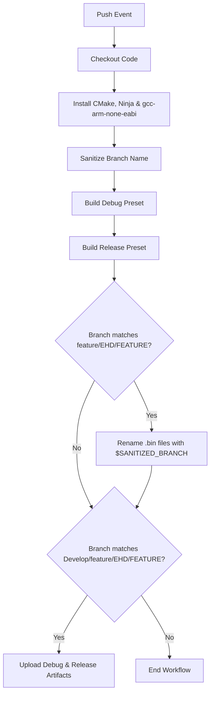

# ARM Embedded CMake Build & Artifact Workflow

A GitHub Actions workflow designed to automate the compilation, binary management, and artifact archiving for ARM Cortex-M/R embedded projects using **CMake**, **Ninja**, and the **GNU Arm Embedded Toolchain** (`gcc-arm-none-eabi`).

---

## 📌 Overview

This workflow triggers on code pushes and performs the following tasks:
1. **Environment Setup:** Installs CMake, Ninja, and the ARM GCC cross-compiler (`gcc-arm-none-eabi`).
2. **Branch Sanitization:** Converts forward slashes `/` in branch names into hyphens `-` to safely name output files.
3. **Dual Compilation:** Builds both **Debug** and **Release** target presets configured in `CMakePresets.json`.
4. **Conditional Binary Renaming:** Automatically prefixes `.bin` artifacts with the sanitized branch name for feature and release-tracking branches (`feature/*`, `FEATURE/*`, `EHD/*`).
5. **Artifact Publishing:** Uploads generated `.bin` build files to GitHub Actions workflow run artifacts for specific target branches (`Develop`, `feature/*`, `EHD/*`, etc.).

---

## 🛠️ Prerequisites

To run this workflow successfully in your repository:

1. **`CMakePresets.json` Configuration:**
   Your repository must contain a valid `CMakePresets.json` file at the root containing configure and build presets named `Debug` and `Release`.

   *Example snippet:*
   ```json
   {
     "version": 3,
     "configurePresets": [
       { "name": "Debug", "generator": "Ninja", "binaryDir": "${sourceDir}/build/Debug" },
       { "name": "Release", "generator": "Ninja", "binaryDir": "${sourceDir}/build/Release" }
     ],
     "buildPresets": [
       { "name": "Debug", "configurePreset": "Debug" },
       { "name": "Release", "configurePreset": "Release" }
     ]
   }
   ```

2. **Toolchain Integration:**
   Ensure your CMake configuration correctly selects the `arm-none-eabi-gcc` toolchain via a toolchain file or CMake variables.

---

## 🚀 Workflow Execution Flow



---

## ⚙️ Trigger Logic & Branch Filters

### File Renaming & Branch Filter Rules

Renaming binaries and uploading artifacts apply conditionally to keep workflow runs clean and prevent cluttering artifact storage:

* **Feature Binary Renaming Target Prefixes:**
  * `feature/*`
  * `FEATURE/*`
  * `EHD/*`

* **Artifact Upload Target Branches:**
  * `Develop`
  * Any branch starting with `feature/`, `FEATURE/`, or `EHD/`

---

## 📂 Output Artifacts

Upon successful completion, the workflow generates two zip packages downloadable directly from the GitHub Actions run details page:

| Artifact Name | Description | Path Match Pattern |
| :--- | :--- | :--- |
| `build-artifacts-Debug` | Compiled binaries built using the `Debug` preset | `build/Debug/**/*.bin` |
| `build-artifacts-Release` | Compiled binaries built using the `Release` preset | `build/Release/**/*.bin` |

---

## 🔧 Workflow YAML Reference

Save this file in your repository at `.github/workflows/arm-build.yml`:

```yaml
name: ARM Build project

on:
  push:

jobs:
  build:
    runs-on: ubuntu-latest

    steps:
      - name: Checkout repository
        uses: actions/checkout@v4

      - name: Set up CMake
        uses: jwlawson/actions-setup-cmake@v2
        with:
          cmake-version: '3.27.7'

      - name: Install ARM GCC Toolchain and build tools
        run: |
          sudo apt-get update
          sudo apt-get install -y gcc-arm-none-eabi ninja-build

      - name: Sanitize branch name
        run: echo "SANITIZED_BRANCH=$(echo '${{ github.ref_name }}' | sed 's/\//-/g')" >> $GITHUB_ENV

      - name: Check CMake version
        run: cmake --version

      - name: Configure and build Debug
        run: |
          cmake --preset Debug
          cmake --build --preset Debug

      - name: Configure and build Release
        run: |
          cmake --preset Release
          cmake --build --preset Release

      - name: List bin files before renaming (feature branches only)
        if: startsWith(github.ref_name, 'feature') || startsWith(github.ref_name, 'EHD') || startsWith(github.ref_name, 'FEATURE')
        run: |
          echo "Debug bin files:"
          ls -lh build/Debug/*.bin || echo "No debug files"
          echo "Release bin files:"
          ls -lh build/Release/*.bin || echo "No release bin files"

      - name: Rename .bin files with branch name
        if: startsWith(github.ref_name, 'feature') || startsWith(github.ref_name, 'EHD') || startsWith(github.ref_name, 'FEATURE')
        run: |
          shopt -s nullglob
          for f in build/Debug/*.bin; do
            mv "$f" "build/Debug/$SANITIZED_BRANCH-$(basename "$f")"
          done
          for f in build/Release/*.bin; do
            mv "$f" "build/Release/$SANITIZED_BRANCH-$(basename "$f")"
          done

      - name: List bin files after renaming (feature branches only)
        if: startsWith(github.ref_name, 'feature') || startsWith(github.ref_name, 'EHD') || startsWith(github.ref_name, 'FEATURE')
        run: |
          echo "Renamed debug bin files:"
          ls -lh build/Debug/*.bin || echo "No debug bin files"
          echo "Renamed release bin files:"
          ls -lh build/Release/*.bin || echo "No release bin files"

      - name: Upload Debug build artifacts
        if: github.event_name == 'push' && (github.ref_name == 'Develop' || startsWith(github.ref_name, 'feature') || startsWith(github.ref_name, 'EHD') || startsWith(github.ref_name, 'FEATURE'))
        uses: actions/upload-artifact@v4
        with:
          name: build-artifacts-Debug
          path: build/Debug/**/*.bin

      - name: Upload Release build artifacts
        if: github.event_name == 'push' && (github.ref_name == 'Develop' || startsWith(github.ref_name, 'feature') || startsWith(github.ref_name, 'EHD') || startsWith(github.ref_name, 'FEATURE'))
        uses: actions/upload-artifact@v4
        with:
          name: build-artifacts-Release
          path: build/Release/**/*.bin
```